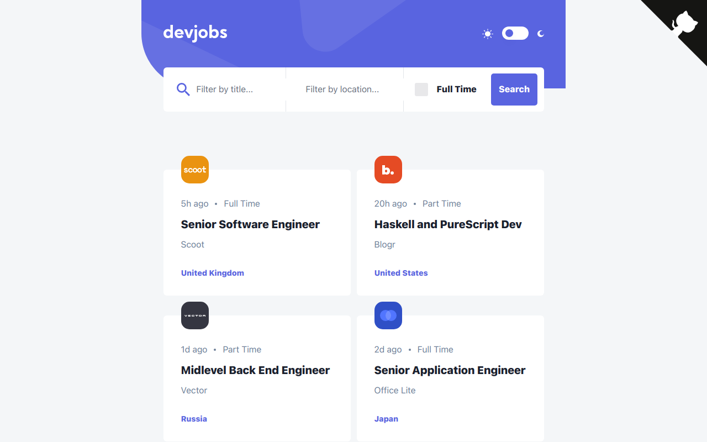

# Frontend Mentor - Devjobs web app solution

This is a solution to the [Devjobs web app challenge on Frontend Mentor](https://www.frontendmentor.io/challenges/devjobs-web-app-HuvC_LP4l). Frontend Mentor challenges help you improve your coding skills by building realistic projects.

## Table of contents

-   [Overview](#overview)
    -   [The challenge](#the-challenge)
    -   [Screenshot](#screenshot)
    -   [Links](#links)
-   [My process](#my-process)
    -   [Built with](#built-with)
    -   [What I learned](#what-i-learned)
-   [Author](#author)

## Overview

### The challenge

Users should be able to:

-   [x] View the optimal layout for each page depending on their device's screen size
-   [x] See hover states for all interactive elements throughout the site
-   [x] Be able to filter jobs on the index page by title, location, and whether a job is for a full-time position
-   [x] Be able to click a job from the index page so that they can read more information and apply for the job
-   [x] **Bonus**: Have the correct color scheme chosen for them based on their computer preferences.

### Screenshot



### Links

-   Solution URL: [https://www.frontendmentor.io/solutions/devjobs-web-app-using-nextjs-13-and-tailwindcss-POA_R6jEYP](https://www.frontendmentor.io/solutions/devjobs-web-app-using-nextjs-13-and-tailwindcss-POA_R6jEYP)
-   Live Site URL: [https://devjobs.chrisnowicki.io](https://devjobs.chrisnowicki.io)

### Built with

-   [Next.js](https://nextjs.org/) - React framework
-   [Next Themes](https://github.com/pacocoursey/next-themes)
-   [Tailwindcss](https://www.tailwindcss.com)
-   JSON

### What I learned

I wanted to focus on learning the new experimental /app directory offered by [Next.js](https://www.nextjs.org). Specifically I wanted to focus on dynamic page rendering server side based on the `id` of the job when trying to view job details.

I also had to learn how to implement 3rd party providers to integrate [Next Themes](https://github.com/pacocoursey/next-themes). Luckily the _Next.js 13_ beta [docs](https://beta.nextjs.org/docs/data-fetching/fetching#static-data-fetchingmd).

Since, by default, the `/app` directory runs on server side so I had to create a separate component to handle the _theme provider_, tell it to run on the client side `'use client'`, and import into the layout component in the _root_ of the `/app` directory.

**Providers.tsx**

```javascript
'use client'
import { ThemeProvider } from 'next-themes'

export default function Providers({ children }: { children: any }) {
    return <ThemeProvider attribute="class">{children}</ThemeProvider>
}
```

**layout.tsx**

```javascript
export default function RootLayout({
    children,
}: {
    children: React.ReactNode,
}) {
    return (
        <html lang="en" className={kumbh.variable}>
            <body className="overflow-y-scroll dark:bg-blue-200">
                <div className="flex flex-col items-center">
                    <Providers>
                        <main>{children}</main>
                    </Providers>
                </div>
               {...}
            </body>
        </html>
    )
}
```

### Continued development

-   [ ] Add Login/Auth feature
-   [ ] Add feature to save jobs to logged in users profile
-   [ ] Add feature to add new jobs if you are an employer
-   [ ] Move data over to a database

## Author

-   Website - [https://www.chrisnowicki.io](https://www.chrisnowicki.io)
-   Frontend Mentor - [@chris-nowicki](https://www.frontendmentor.io/profile/chris-nowicki)
-   Twitter - [@iamwix](https://www.twitter.com/iamwix)
